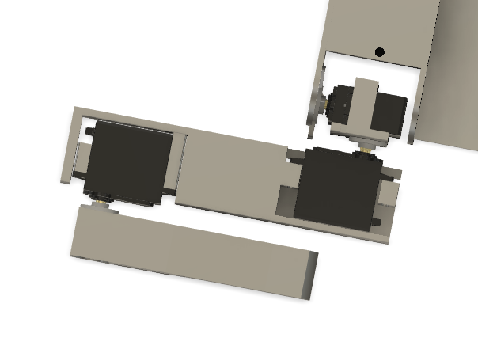
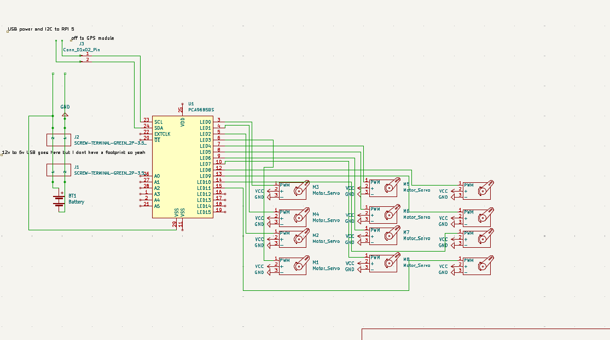
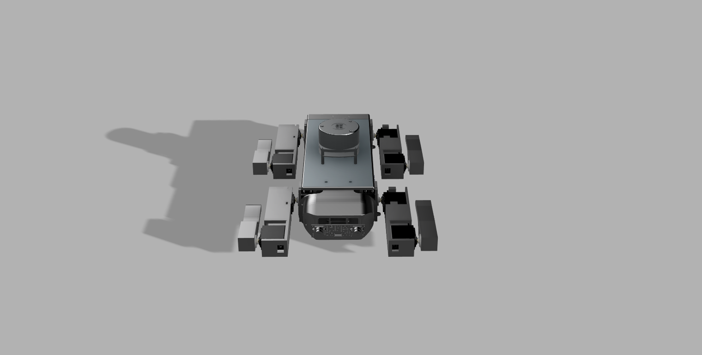
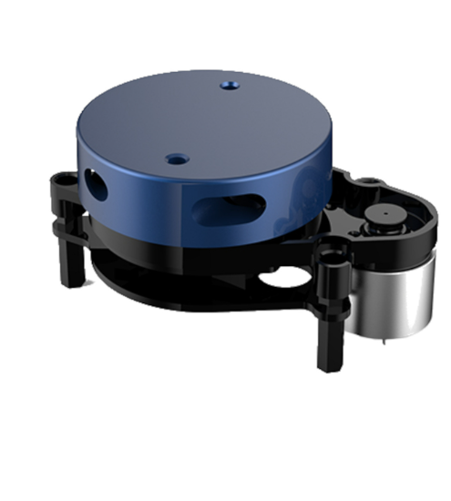

**Total Time: 28hrs**

# June 11th-12th: Fully CADed

Started off the project by launching Fusion 360 and blocking out the dog's main chassis. My main goal here was **functional simplicity** — something that’s easy to assemble, modify, and mount hardware on without disassembling half the bot every time I want to tweak one wire.

The design I landed on has:

- A **flat center plate** that acts as the main body, made wide enough to comfortably hold the Pi, power distribution boards, battery, GPS, and (hopefully) a lidar
- **Two rounded end plates** — just simple ovals that hold the servo brackets in place for each leg. These are symmetric and bolt straight onto the side of the center plate
- Leg brackets aligned vertically to simplify the IK — each leg has a clean coordinate frame, and the coxa (hip) servo only rotates in one axis

The whole CAD is parametric, so I can tweak servo spacing or leg lengths later without rebuilding everything.

For now, I decided **not** to CAD any decorative shells or aesthetic casings — this robot is going to get opened and torn apart regularly as I iterate. Covers just slow down dev time and make wiring hellish.

The legs themselves are **3DOF**, made up of:

- Coxa (horizontal rotation)
- Femur (up/down swing)
- Tibia (final linkage)

I'm using **MG996R servos** for all joints. They’re not ideal — big dead zones, analog feedback, and can burn out under load — but for their price and torque (~10kg-cm), they’re a solid starting point for a dev platform.

At this point, I’m happy with the mechanical design — but it took way longer than expected (I’m 3 Red Bulls deep and very aware that I should’ve sketched this on paper first).

**Time Spent: 15hrs**

---

# June 13th - Schematic

Did the full schematic layout for wiring everything together.

The build doesn’t use a custom PCB (at least not yet), so this schematic was mostly to organize:

- 12x MG996R servos (3 per leg)
- 1x PCA9685 servo driver
- Pi 4 power via USB boost board
- GPS module via UART
- Optional second PCA driver for expansion

Used the schematic as a build reference, mainly so I don’t fry something expensive. 
 
**Time Spent: 2hr**

---

# June 14th - Firmware Pt1

Finally jumped into the firmware side — specifically the **inverse kinematics (IK)** solver.

I started with basic 2D planar IK just to get a feel for how the math works. Then gradually added complexity:

- Each leg is modeled as a 3-link manipulator
- The joints are offset in real 3D space but constrained to operate on a 2D plane per leg
- Used basic trigonometry — cosine law, sine law — to solve for femur and tibia angles
- The coxa joint is just a simple `atan2(y, x)` to find the rotation from the robot’s center to the leg’s target

The trickiest bit was solving for reachable vs. unreachable points — since these are cheap servos, they can't actually hold position reliably under tension. So I added a soft clamping system that limits paw positions to a safe working volume per leg.

Once the math was stable, I built a standalone Python test script that:

- Lets you type in an XYZ paw coordinate
- Solves and visualizes the joint angles
- Outputs the result in degrees, ready to be piped to the servo driver later

Also added some forward kinematics functions so I can sanity-check the solved angles (and catch bugs in weird limb configs).

Next: wrap this math in a ROS node.

**Time Spent: 5hr**

---

# June 17th - Updated CAD and Finished Firmware

Added a lid! The barebones open-top chassis was good for dev, but I was worried about connector damage or shorting stuff on the metal servo cases. So: added a snap-on lid. 

Finished the Python-based firmware:

- IK engine is now stable and modular
- It supports per-leg calibration offsets
- Outputs angle commands in degrees (for PCA9685)

Next step: slap it into ROS. 

Also, I decided against using a PCB because of one simple reason: cost 
If I were to make a PCB, i could make two different ones for two different purposes 

- One could be a power distribution PCB with the XY3006, just with an XT60 input but with PCBA costs and import duties, a 150 rupee xy3006 board + a cheap XT60 plug to wire thing looks much better in front of a 5k+ PCBA(not even including the 100%+ import duties(thanks, nirmala))
- Another one could be a PCA9685 carrier board with an I2C multiplexer but honestly I can slap both of those together for 15-20x cheaper because yet again(lets say it together), our lord and saviour, nirmala sitaraman 
  I do understand the point of highway is for us to do things like this but honestly it just seems irresponsible, and I think my project will have enough complexity with the ROS stuff coming up 
  **Time Spent: 4hr**

---

# June 17th-18th - ROS TIME BAYBEEEEEEEEEEE!

Wrapped up the ROS2 workspace! This was the big milestone. The whole project is now structured as 4 packages:

---

### **servo_driver**

The hardware abstraction layer.  
Written in `rclpy`, this node:

- Talks to one (or two) PCA9685 servo drivers via I2C
- Receives joint angle commands (in radians or degrees)
- Publishes current servo state (mostly for debugging)
- Has a watchdog system to stop movement if no command received

It exposes:

- `/set_joint_angle` service (per joint)
- `/set_leg_pose` topic (batch commands per leg)
- Optional `/enable_torque` toggle

---

### **leg_walker**

This is the brain of the walking system. It:

- Handles IK calculations per leg
- Has a gait generator (currently trot, more coming)
- Coordinates paw trajectories using phase offsets and timing
- Publishes joint angles to `servo_driver`
- Includes a `walk_controller` node to send commands like `walk_forward(speed)` or `rotate_left(angle)`

Uses a parameterized `robot.yaml` config to define joint lengths, servo orientations, and bounds.

---

### **slam_yplidar_x2**

Runs 2D SLAM using a YDLidar X2 sensor.

Launches:

- `ydlidar_ros2_driver` (reads Lidar via serial)
- `slam_toolbox` (in synchronous mode)
- Static transforms to `/base_link`
- RViz with a custom config

Map is built in real-time and saved to a `.pgm`+`.yaml` pair. Robot pose is published on `/slam_pose`.

---

### **slam_stereo_picams**

Alternate 3D SLAM method using two Raspberry Pi cameras as a stereo pair (synchronized via GPIO).  
Still very much a WIP, but:

- Captures stereo image streams using `picamera2`
- Uses OpenCV stereo depth maps (SGM block matcher)
- Optionally feeds depth + RGB into `rtabmap_ros`
- Will be used for outdoor SLAM and low-light mapping

This branch will probably get moved to a Jetson board for performance.

---

 
**Time Spent: 2hr**
