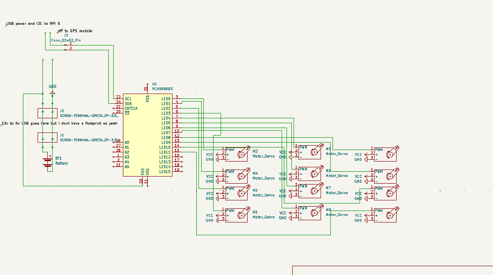

**Total Time: 32.5hrs**

# June 11th-12th: Fully CADed

Started off the project by launching Fusion 360 and blocking out the dog's main chassis. My main goal here was **functional simplicity** — something that’s easy to assemble, modify, and mount hardware on without disassembling half the bot every time i want to add/remove something.

The design I landed on has:

- A **flat center plate** that acts as the main body, made wide enough to comfortably hold the Pi, power distribution boards, battery, GPS, and (hopefully) a lidar
- **Two rounded end plates** — just simple ovals that hold the servo brackets in place for each leg. These are symmetric and bolt straight onto the side of the center plate
- Leg brackets aligned vertically to simplify the IK — each leg has a clean coordinate frame, and the coxa (hip) servo only rotates in one axis

The whole CAD is parametric, so I can tweak servo spacing or leg lengths later without rebuilding everything.

For now, I decided **not** to CAD any decorative shells or aesthetic casings — this robot is going to get opened and torn apart regularly as I iterate.

The legs themselves are **3DOF**, made up of:

- Coxa (horizontal rotation)
- Femur (up/down swing)
- Tibia (final linkage)

I'm using **MG996R servos** for all joints. They’re not ideal — big dead zones, analog feedback, and can burn out under load — but for their price and torque (~10kg-cm), they’re a solid starting point for a dev platform.

At this point, I’m happy with the mechanical design — but it took way longer than expected (I’m 3 redbulls deep and fully aware that I should’ve sketched this on paper first, but I cannot draw).

**Time Spent: 15hrs**

---

# June 13th - Schematic

Did the full schematic layout for wiring everything together.

The build doesn’t use a custom PCB (at least not yet), so this schematic was mostly to organize:

- 12x MG996R servos (3 per leg)
- 1x PCA9685 servo driver
- Pi 4 power via USB boost board
- Optional second PCA driver for expansion

Used the schematic as a build reference, mainly so I don’t fry something expensive. 
 
**Time Spent: 2hr**

---

# June 14th - Firmware Pt1

Finally jumped into the firmware side — specifically the **inverse kinematics (IK)** solver.

I started with basic 2D planar IK just to get a feel for how the math works. Then gradually added complexity:

- Each leg is modeled as a 3-link manipulator
- The joints are offset in real 3D space but constrained to operate on a 2D plane per leg
- Used basic trigonometry — cosine law, sine law — to solve for femur and tibia angles
- The coxa joint is just a simple `atan2(y, x)` to find the rotation from the robot’s center to the leg’s target

The trickiest bit was solving for reachable vs. unreachable points — since these are cheap servos, they can't actually hold position reliably under tension. So I added a soft clamping system that limits paw positions to a safe working volume per leg.

Once the math was stable, I built a standalone Python test script that:

- Lets you type in an XYZ paw coordinate
- Solves and visualizes the joint angles
- Outputs the result in degrees, ready to be piped to the servo driver later

Also added some forward kinematics functions so I can sanity-check the solved angles (and catch bugs in weird limb configs).

Next: wrap this math in a ROS node.

**Time Spent: 5hr**

---

# June 17th - Updated CAD and Finished Firmware

Added a lid! The barebones open-top chassis was good for dev, but I was worried about connector damage or shorting stuff on the metal servo cases. So: added a snap-on lid. 

Finished the Python-based firmware:

- IK engine is now stable and modular
- It supports per-leg calibration offsets
- Outputs angle commands in degrees (for PCA9685)

Next step: slap it into ROS. 
**Time Spent: 4hr**

---

# June 17th-18th - ROS TIME BAYBEEEEEEEEEEE!

Wrapped up the ROS2 workspace! This was the big milestone. The whole project is now structured as 4 packages:

1. **servo_driver** – I2C interface to PCA9685, angle commands, watchdog safety.
2. **leg_walker** – IK per leg, gait generation, coordinated trajectories.
3. **slam_yplidar_x2** – 2D SLAM pipeline with YDLidar X2 + slam_toolbox.
4. **slam_stereo_picams** – WIP stereo depth + SLAM for outdoor mapping.

This structure keeps hardware control, locomotion logic, and perception modules separate — easier to maintain and swap out later.
 
**Time Spent: 2hr**

# August 10th - PCB time _bruh_

alright so it appears I do HAVE to make a PCB, so I kinda slapped everything I could on there - servo control, power and even an IMU for stabilizing the robot(integrated into my gait stuff in ROS) 
I used a BNO086 for the IMU, a PCA9685 for servo control and this super cool ic, the TPS51397ARJER for power(anything VIN to 5v!!) reccomended to me by my friend aarav 
This is also SUPER small, so this should make our situation much more compact on the dog 

**Time Spent: 4.5hr**
