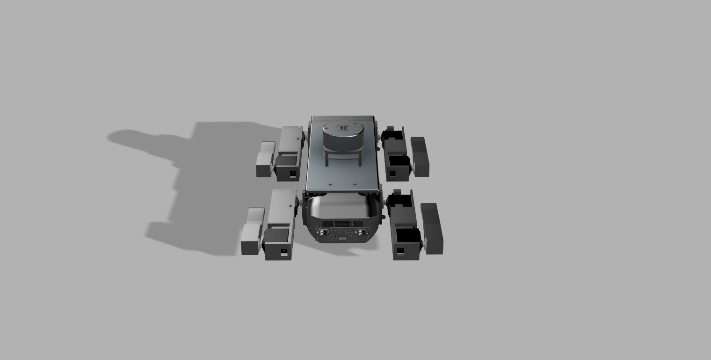

# ROS Doggo

A quadruped robot platform running ROS2 Humble on a Raspberry Pi 4 with 3DOF legs and an optional SLAM capability via either Lidar or stereo vision. 

This is a personal robotics project built to serve as a solid starting point for a walking research platform — I want to use this for SLAM, gait optimization and path planning 

**Design** 
I started off by CADing the entire thing 
Went with a central plate that houses all the power distribution + electronics, and simple oval-style end mounts for the legs. 
The legs are 3DOF and use MG996R servos — cheap, decently powerful, and a pain to tune. 
 

Later added a lid to keep things *mostly* protected. 
 

**Electronics** 
The schematic includes:
- 12 MG996R servos
- A single PCA9685 PWM driver (with the idea of expanding to 2)
- Raspberry Pi power delivery
No PCB used here — everything's connected with wires as they're all breakout boards. 
 

**Firmware** 
Simple IK solver used here. Each leg is calculated individually for target paw positions. Movement commands go from target XYZ to per-joint angles, and then to PWM signals.

**ROS Packages**  
The whole ROS workspace is structured into 4 main packages:

- **servo_driver**:  
  Hardware interface for the MG996Rs, using dual PCA9685 drivers and some basic interpolation

- **leg_walker**:  
  Main IK logic and paw trajectory planning — takes in commands and tells the legs where to go.

- **slam_yplidar_x2**:  
  SLAM using a YD Lidar X2 + `slam_toolbox`. Only really works indoors, but lets doggo know where it is.

- **slam_stereo_picams**:  
  Experimental SLAM using stereo Raspberry Pi cameras + semi-jank depth estimation pipeline.

 

**BOM**
| ITEM                    | QTY | TOTAL  | SRC                                                                                                                                                                                                                                                                                                                                                                                                                                                                                                                                                                                                                                                                                                                                                                                                                                                                                                                                                                                                                                              | NOTES                                                                                                                         |
| ----------------------- | --- | ------ | ------------------------------------------------------------------------------------------------------------------------------------------------------------------------------------------------------------------------------------------------------------------------------------------------------------------------------------------------------------------------------------------------------------------------------------------------------------------------------------------------------------------------------------------------------------------------------------------------------------------------------------------------------------------------------------------------------------------------------------------------------------------------------------------------------------------------------------------------------------------------------------------------------------------------------------------------------------------------------------------------------------------------------------------------ | ----------------------------------------------------------------------------------------------------------------------------- |
| Raspberry Pi 5 8GB      | 1   | 94.82  | [https://www.silverlineelectronics.in/collections/raspberry-pi-5-official-accessories/products/raspberry-pi-5-model-b-8gb-ram](https://www.silverlineelectronics.in/collections/raspberry-pi-5-official-accessories/products/raspberry-pi-5-model-b-8gb-ram)                                                                                                                                                                                                                                                                                                                                                                                                                                                                                                                                                                                                                                                                                                                                                                                     | I require an 8GB because I dont just need to use ROS - within it, I also need to do SLAM(even more computationally expensive) |
| RPi 5 Active Cooler     | 1   | 5.27   | [https://www.silverlineelectronics.in/collections/raspberry-pi-cooling-tech](https://www.silverlineelectronics.in/collections/raspberry-pi-cooling-tech)                                                                                                                                                                                                                                                                                                                                                                                                                                                                                                                                                                                                                                                                                                                                                                                                                                                                                         |                                                                                                                               |
| SD Card                 | 1   | 6.93   | [https://www.amazon.in/SAMSUNG-Adaptor-Expanded-Storage-MB-MC64SA/dp/B0CXJ5Q222/ref=sr_1_3?crid=2JX27GGIJJTGI&dib=eyJ2IjoiMSJ9.W0mEzbMqa_UC3GB83swgkYea9f_3bRa4nMoh5j8uNEkChp42zWEkQpLMc0DnmWqmeu-AuuhK89UciyKu_5SFswRarCA-pBkkO60Q20oIBA_fkTCwYzRS_bEmYCP8yWifGQWiN7IS3pzrRxGHj_bR59EVNZ7nKRTTJQgCTymu6a5_LKu5mFX9u4Qt-aeNY8PHtSEAPnHDRGtQwz8awrEL67j54Ov63FOAKBYw6o2EqSo.z2cyXBa8m8xP1fLej5w40OuPwxTdFYv78CPP1mV_vY4&dib_tag=se&keywords=64gb+sd+card+evo&qid=1750190942&sprefix=64gb+sd+card+evo,aps,226&sr=8-3&th=1](https://www.amazon.in/SAMSUNG-Adaptor-Expanded-Storage-MB-MC64SA/dp/B0CXJ5Q222/ref=sr_1_3?crid=2JX27GGIJJTGI&dib=eyJ2IjoiMSJ9.W0mEzbMqa_UC3GB83swgkYea9f_3bRa4nMoh5j8uNEkChp42zWEkQpLMc0DnmWqmeu-AuuhK89UciyKu_5SFswRarCA-pBkkO60Q20oIBA_fkTCwYzRS_bEmYCP8yWifGQWiN7IS3pzrRxGHj_bR59EVNZ7nKRTTJQgCTymu6a5_LKu5mFX9u4Qt-aeNY8PHtSEAPnHDRGtQwz8awrEL67j54Ov63FOAKBYw6o2EqSo.z2cyXBa8m8xP1fLej5w40OuPwxTdFYv78CPP1mV_vY4&dib_tag=se&keywords=64gb+sd+card+evo&qid=1750190942&sprefix=64gb+sd+card+evo,aps,226&sr=8-3&th=1) |                                                                                                                               |
| Waveshare Stereo Camera | 1   | 47.76  | [https://hubtronics.in/imx219-83-stereo-camera](https://hubtronics.in/imx219-83-stereo-camera)                                                                                                                                                                                                                                                                                                                                                                                                                                                                                                                                                                                                                                                                                                                                                                                                                                                                                                                                                   |                                                                                                                               |
| YDLIDAR X2              | 1   | 60.99  | [https://www.electronicscomp.com/ydlidar-x2-360-degree-ros-scanner-for-navigation-collision-avoidance-8m?srsltid=AfmBOorwLINheGIH6_5-cDKKJgGNAVWmLa5pv0aLsJ3wuyl8X8SN1hhzP3Q&gRefinements=SORT_BY:Price:+low+to+high](https://www.electronicscomp.com/ydlidar-x2-360-degree-ros-scanner-for-navigation-collision-avoidance-8m?srsltid=AfmBOorwLINheGIH6_5-cDKKJgGNAVWmLa5pv0aLsJ3wuyl8X8SN1hhzP3Q&gRefinements=SORT_BY:Price:+low+to+high)                                                                                                                                                                                                                                                                                                                                                                                                                                                                                                                                                                                                       |                                                                                                                               |
| PCA9685                 | 2   | 2.85   | [https://ebhoot.in/shop-2/electronics-modules/motor-driver-modules/pca9685-16-channel-12-bit-pwm-servo-driver-i2c-interface/](https://ebhoot.in/shop-2/electronics-modules/motor-driver-modules/pca9685-16-channel-12-bit-pwm-servo-driver-i2c-interface/)                                                                                                                                                                                                                                                                                                                                                                                                                                                                                                                                                                                                                                                                                                                                                                                       | Already have one, so total is for one of these                                                                                |
| XY3006                  | 1   | 1.37   | [https://ebhoot.in/shop-2/electronics-modules/buck-boost-converters/12v-24v-to-5v-5a-power-module-dc-dc-xy-3606-power-converter/?gad_source=1&gad_campaignid=21449576071&gclid=CjwKCAjwx8nCBhAwEiwA_z__00JWTz0lmIYmjgigmuLrG_mB9NXK0m6Z8M0n4_vqbH1e5E6pjkPP_RoCT4sQAvD_BwE](https://ebhoot.in/shop-2/electronics-modules/buck-boost-converters/12v-24v-to-5v-5a-power-module-dc-dc-xy-3606-power-converter/?gad_source=1&gad_campaignid=21449576071&gclid=CjwKCAjwx8nCBhAwEiwA_z__00JWTz0lmIYmjgigmuLrG_mB9NXK0m6Z8M0n4_vqbH1e5E6pjkPP_RoCT4sQAvD_BwE)                                                                                                                                                                                                                                                                                                                                                                                                                                                                                           |                                                                                                                               |
| XT-60 Adapter           | 1   | 1.34   | [https://www.flyrobo.in/xt60-male-dc-jack-male-plug-connector?tracking=ads&srsltid=AfmBOopBsr8yGGmiQB9ifpqzdHga3PDd0xyMWqODkcGKdwBzT738jNK1JGw](https://www.flyrobo.in/xt60-male-dc-jack-male-plug-connector?tracking=ads&srsltid=AfmBOopBsr8yGGmiQB9ifpqzdHga3PDd0xyMWqODkcGKdwBzT738jNK1JGw)                                                                                                                                                                                                                                                                                                                                                                                                                                                                                                                                                                                                                                                                                                                                                   | With shipping                                                                                                                 |
| MG996R                  | 12  | 48.62  | [https://sharvielectronics.com/product/mg996r-metal-gear-servo-motor/?srsltid=AfmBOoqSlyks-1TuudDgubd_qj9fNCwaQsQTs6MFmUkCxiBuGM9Gln68fNU](https://sharvielectronics.com/product/mg996r-metal-gear-servo-motor/?srsltid=AfmBOoqSlyks-1TuudDgubd_qj9fNCwaQsQTs6MFmUkCxiBuGM9Gln68fNU)                                                                                                                                                                                                                                                                                                                                                                                                                                                                                                                                                                                                                                                                                                                                                             |                                                                                                                               |
|                         |     |        |                                                                                                                                                                                                                                                                                                                                                                                                                                                                                                                                                                                                                                                                                                                                                                                                                                                                                                                                                                                                                                                  |                                                                                                                               |
|                         |     | 269.95 |                                                                                                                                                                                                                                                                                                                                                                                                                                                                                                                                                                                                                                                                                                                                                                                                                                                                                                                                                                                                                                                  |                                                                                                                               |