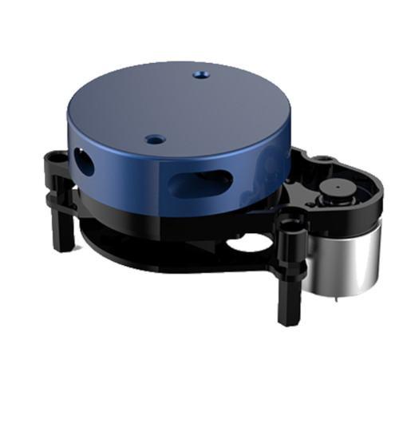

# ROS Doggo

A quadruped robot platform running ROS2 Humble on a Raspberry Pi 4 with 3DOF legs and an optional SLAM capability via either Lidar and stereo vision. 

**Design** 
I started off by CADing the entire thing, keeping in mind that this will be an actively developed platform — no fancy covers, just raw plate and servo mounts. 
Went with a central plate that houses all the power distribution + electronics, and simple oval-style end mounts for the legs. 
The legs are 3DOF and use MG996R servos — cheap and decently powerful 
 

Later added a lid to keep things _mostly_ protected. 
 

**Electronics** 
The schematic includes:

- 12 MG996R servos
- PCA9685 PWM driver
- Raspberry Pi w/ power delivery board
- GPS for potential a-b navigation
  No PCB used here  
   

**Firmware** 
**ROS Packages**  
The whole ROS workspace is structured into 4 main packages:

- **servo_driver**  
  The hardware interface layer. This node communicates with one or more PCA9685 boards via I2C to send position signals to each servo motor. It exposes a simple ROS2 service + topic interface that allows other nodes to command joint angles (in degrees or radians). It also implements basic limits, deadzone filtering, and optional torque hold toggling. Each servo is mapped to a specific joint name and leg index.

- **leg_walker**  
  This package does all the IK heavy lifting. It:

  - Subscribes to target paw positions (either via a `/cmd_paw_pos` topic or internal walking scripts)
  - Solves 3DOF inverse kinematics per leg (coxa, femur, tibia)
  - Publishes joint angles to the `servo_driver`
  - Supports gait generation — currently just a trot gait, but it's modular
  - Includes walking state machines, leg timing, and paw trajectory interpolation
    This is where all the math happens.

- **slam_yplidar_x2**  
  SLAM package using the YDLidar X2. It launches:

  - A serial connection to the Lidar via `ydlidar_ros2_driver`
  - `slam_toolbox` in synchronous mode
  - RViz config for map + robot visualization
    Outputs a 2D occupancy map and robot pose estimate. Currently uses fake odom + map merging but will be upgraded later with IMU + gait odometry.

- **slam_stereo_picams**  
  Alternate SLAM method using two Raspberry Pi cameras as a stereo pair (synced via GPIO trigger). It:
  - Captures stereo image pairs
  - Runs semi-global block matching or other stereo algorithm (WIP: OpenCV + rtabmap)
  - Feeds into `rtabmap_ros` for visual SLAM
  - Outputs a 3D point cloud and pose estimate
    This is mostly experimental right now but promising for GPS-denied areas and outdoor mapping.

 

**NOTE**: Reusing the lipo battery from a diff project 
