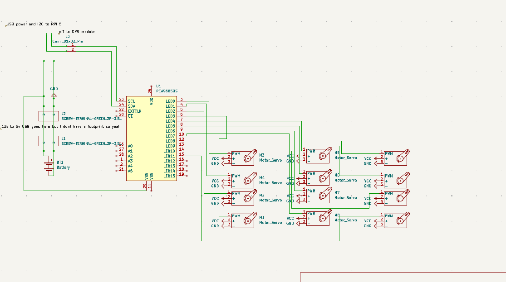

# ROS Doggo

A quadruped robot platform running ROS2 Humble on a Raspberry Pi 4 with 3DOF legs and an optional SLAM capability via either Lidar and stereo vision. 

**Design** 
I started off by CADing the entire thing, keeping in mind that this will be an actively developed platform — no fancy covers, just raw plate and servo mounts. 
Went with a central plate that houses all the power distribution + electronics, and simple oval-style end mounts for the legs. 
The legs are 3DOF and use MG996R servos — cheap and decently powerful 
 

Later added a lid to keep things _mostly_ protected. 
 

**Electronics** 
The schematic includes:

- 12 MG996R servos
- PCA9685 PWM driver
- Raspberry Pi w/ power delivery board
- GPS for potential a-b navigation
  No PCB used here  
   

**Firmware** 
**ROS Packages**  
The whole ROS workspace is structured into 4 main packages:

- **servo_driver**:  
  Hardware interface for the MG996Rs, using dual PCA9685 drivers and some basic smoothing to prevent servo death.

- **leg_walker**:  
  Main IK logic and paw trajectory planning — takes in commands and tells the legs where to go.

- **slam_yplidar_x2**:  
  SLAM using a YD Lidar X2 + `slam_toolbox`. Only really works indoors, but lets doggo know where it is

- **slam_stereo_picams**:  
  Experimental SLAM using stereo Raspberry Pi cameras + semi-jank depth estimation pipeline.

 

**NOTE**: Reusing the lipo battery from a diff project 
